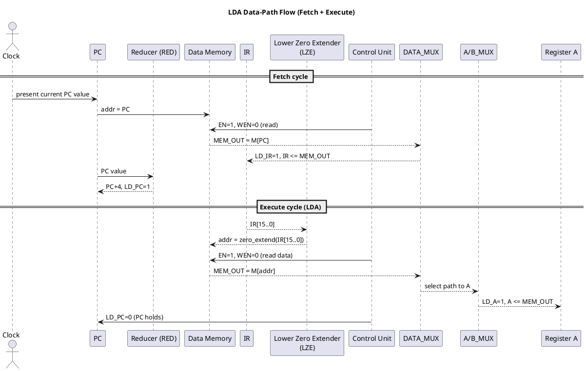

## LDA Instruction – Data‑Path, Control, and Waveforms

This note explains, for the **LDA** instruction in the given single‑cycle CPU:

- **Where the data flows** in the datapath.
- **Which control signals** are asserted.
- **How memory, zero‑extenders, and the reducer** are involved (or not).
- A **PlantUML sketch** you can paste into a UML tool to visualize the flow.

The description is intentionally **opcode‑specific** (LDA only) and assumes a basic **two‑cycle machine**:

1. **Fetch cycle** – load instruction from memory into `IR`, increment `PC`.
2. **Execute cycle (LDA)** – perform the memory read and load register `A`.

---

## 1. Instruction Format and Functional Meaning

For LDA we assume the instruction has the form:

\[
\text{LDA } A, \text{[addr16]}
\]

- **Opcode**: `IR_OUT[31..16]`
- **16‑bit address/immediate field**: `IR_OUT[15..0]`
- **Semantic effect**:
  - `A <= M[ IR[15..0] ]`
  - `PC` is **not changed** in the execute cycle (it was already updated during fetch).

This matches the presence of the **Lower Zero Extender (LZE)** hanging off the **low 16 bits** of `IR`.

---

## 2. High‑Level Data Flow for LDA

### 2.1 Fetch Cycle (common to all instructions)

- **Goal**: `IR <= M[PC]` and `PC <= PC + 4`.
- **Data movement**:
  - `PC` drives the **address bus** via the `RED`/`ADDR_OUT` block.
  - Data memory does a **read**:
    - `EN = 1`, `WEN = 0`.
    - `MEM_OUT` returns the 32‑bit instruction word.
  - `MEM_OUT` goes through `DATA_MUX` (select = memory) to the internal `DATA_BUS`.
  - `IR` is loaded from `DATA_BUS` with `LD_IR = 1`.
  - In parallel, the **Reducer (RED)** unit increments `PC` (e.g., `PC + 4`) and then `LD_PC = 1`, `INC_PC = 1` for `PC <= PC + 4`.

The result at the end of this clock:

- `IR` holds the LDA instruction.
- `PC` points to the **next** instruction.

### 2.2 Execute Cycle (LDA‑specific)

- **Goal**: `A <= M[ IR[15..0] ]`.
- **Data movement**:
  1. **Address generation**
     - The **Lower Zero Extender (LZE)** takes `IR_OUT[15..0]` and produces a **32‑bit zero‑extended address**:
       - `addr32 = 0x0000 || IR[15..0]`.
     - `addr32` feeds the **address input** of the data memory via the `REG_MUX` path (select = *immediate address*).
  2. **Memory read**
     - Control unit asserts: `EN = 1`, `WEN = 0` (read mode).
     - At the active clock edge, data memory outputs:
       - `MEM_OUT = M[addr32]`.
  3. **Routing memory data to A**
     - `MEM_OUT` is selected by `DATA_MUX` and driven onto `DATA_IN` / `DATA_BUS`.
     - `A/B_MUX` is set to route the bus into **register A’s input**.
     - Control unit asserts `LD_A = 1` (with `CLR_A = 0`), so on the same edge:
       - `A <= MEM_OUT`.
  4. **Other units**
     - `PC` is **not** modified: `LD_PC = 0`, `INC_PC = 0`.
     - `IR` is held: `LD_IR = 0`, `CLR_IR = 0`.
     - ALU and flags (`Z`, `C`) are **don’t‑care / idle** for LDA; the ALU is effectively bypassed.

End of execute cycle:

- Register **`A` contains the loaded memory word**.
- `PC` already points to the next instruction from the fetch cycle.

---

## 3. Control Signals for LDA

This section maps the textual description above to the **control signal table** columns you have in the lab.

> Note: Exact 0/1 polarity for some fields may differ slightly from your instructor’s convention; the **relative relationships** (who is enabled and what each mux selects) are what matter for understanding the waveform.

### 3.1 Fetch Cycle Row (common)

- **`PC <= PC+4` row in your table**:
  - `LD_PC = 1`, `INC_PC = 1` (or an explicit `PC+4` select).
  - Memory: `EN = 1`, `WEN = 0`.
  - `DATA_MUX` selects memory output for the bus.
  - `LD_IR = 1`, `CLR_IR = 0`.

### 3.2 LDA Execute Cycle Row

For the **LDA** row in Table 1, during the execute cycle the control unit should assert approximately:

- **IR / PC control**
  - `CLR_IR = 0`
  - `LD_IR = 0`  (IR already latched)
  - `LD_PC = 0`
  - `INC_PC = 0`
- **Register enables**
  - `LD_A = 1`, `CLR_A = 0`
  - `LD_B = 0`, `CLR_B = 0`
  - `LD_C = 0`, `CLR_C = 0`
  - `LD_Z = 0`, `CLR_Z = 0`
- **ALU / flags**
  - `ALU_OP = xxx` (don’t care; ALU result is not used)
- **Memory**
  - `EN = 1` (memory active)
  - `WEN = 0` (read)
- **Mux selects**
  - `A/B_MUX` = select **A** path input from `DATA_BUS` (not B).
  - `REG_MUX` = select **zero‑extended IR[15..0]** as the **memory address**.
  - `DATA_MUX` = select **`MEM_OUT`** onto `DATA_BUS` (not ALU result).
  - `IM_MUX1`, `IM_MUX2` = any values that keep the ALU path from driving the bus (often “don’t care” for LDA).

These settings produce the exact flow: **IR[15..0] → LZE → memory address → MEM_OUT → data bus → A.**

---

## 4. Memory‑Based Operations in LDA

- **Address source**:
  - Comes from `IR[15..0]` via the **Lower Zero Extender**.
  - This makes LDA a **direct‑addressing** load: the instruction encodes the memory address.
- **Read semantics**:
  - With `EN=1, WEN=0`, the data memory performs a **pure read**:
    - No locations are modified.
    - `data_out` is the stored 32‑bit word at `addr32`.
- **Timing vs. waveforms**:
  - You will see `addr` become the zero‑extended immediate,
  - Then at the active clock edge, `MEM_OUT` changes from the previous word to the loaded word,
  - Shortly after (within the same simulated cycle) `A` updates when `LD_A` is asserted.

So on the waveform:

- `addr` steps to the new value from `IR[15..0]`.
- On the read cycle, `MEM_OUT` jumps from its prior value to `M[addr]`.
- `A` then matches `MEM_OUT` at the clock where `LD_A=1`.

---

## 5. Zero Extenders and Reducer in LDA

### 5.1 Lower Zero Extender (LZE)

From Figure 4:

- Input: `IR_OUT[15..0]` (lower 16 bits of the instruction).
- Output: 32‑bit bus where **upper 16 bits are zero**.
- For LDA:
  - This output is chosen by `REG_MUX` to feed **memory’s `addr`**.
  - Purpose: treat a 16‑bit field as a full 32‑bit **unsigned address** without sign extension.

### 5.2 Upper Zero Extender (UZE)

- UZE takes the **upper 16 bits** (e.g., for `LUI` or immediate ALU operations) and zero‑extends them.
- For **LDA** specifically, UZE is typically **not used**:
  - The address comes from the **lower** 16 bits, so only the LZE is active.

### 5.3 Reducer Unit (RED)

- The **Reducer (RED)** near the PC is responsible for:
  - Computing `PC + 4` (or similar increment).
  - Providing control over when `PC` is updated (`LD_PC`, `INC_PC`).
- For **LDA execute**:
  - `RED` is effectively **idle**; `PC` was already incremented in the **fetch** cycle.
  - Therefore you expect no visible change to `PC` on the LDA execute waveform.

---

## 6. Why the Waveform Looks the Way It Does (LDA)

In a simulation where you step through **Fetch → Execute(LDA)** you should observe:

- **Cycle N (Fetch)**
  - `addr` = current `PC` value.
  - `MEM_OUT` becomes the instruction word.
  - `IR` updates to that word (`LD_IR=1`).
  - `PC` increments (`PC <= PC+4`), visible as a step on the `PC` waveform.
- **Cycle N+1 (Execute LDA)**
  - `addr` switches from `PC` to **zero‑extended `IR[15..0]`**.
  - `MEM_OUT` changes from the instruction word to **memory data** at that address.
  - `A` is flat until the active edge with `LD_A=1`, then steps to that same data word.
  - `PC` stays flat (no increment), `IR` stays flat (no new load), ALU outputs and flags may show no meaningful change.

This explains the characteristic pattern:

- A **PC step** and **IR update** in the fetch cycle,
- Followed by a **memory‑data read** and **A register update** one cycle later,
- With **no additional PC movement** during the LDA execute cycle.

---

## 7. PlantUML Data‑Flow Sketch for LDA

You can paste the following into a PlantUML‑compatible UML tool. It shows a **high‑level sequence** of the LDA data movement across the major blocks.

This diagram encodes the same story in a form you can visually inspect:

- **Who drives the memory address** in each cycle.
- **Which muxes** are active.
- **Which registers** capture values at each clock edge.

That mapping is exactly what explains the shape of the **LDA waveforms** you see in simulation.

