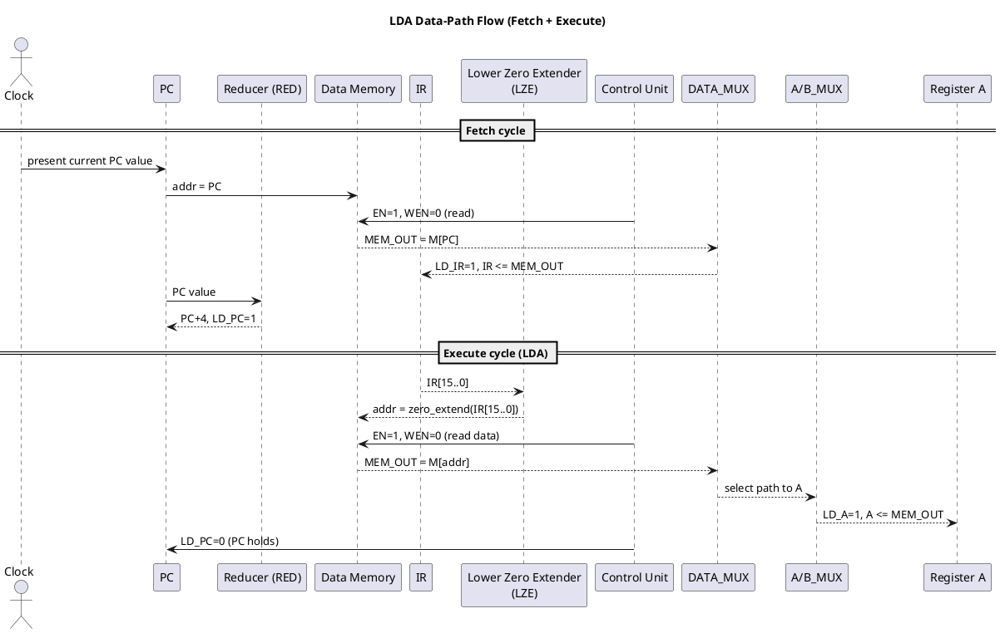

## LDA Instruction – Data‑Path, Control, and Waveforms

This note explains, for the **LDA** instruction in the given single‑cycle CPU:

- **Where the data flows** in the datapath.
- **Which control signals** are asserted.
- **How memory, zero‑extenders, and the reducer** are involved (or not).
- A **PlantUML sketch** you can paste into a UML tool to visualize the flow.

The description is intentionally **opcode‑specific** (LDA only) and assumes a basic **two‑cycle machine**:

1. **Fetch cycle** – load instruction from memory into `IR`, increment `PC`.
2. **Execute cycle (LDA)** – perform the memory read and load register `A`.

---

## 1. Instruction Format and Functional Meaning

For LDA we assume the instruction has the form:

\[
\text{LDA } A, \text{[addr16]}
\]

- **Opcode**: `IR_OUT[31..16]`
- **16‑bit address/immediate field**: `IR_OUT[15..0]`
- **Semantic effect / goal of LDA in this lab**:
  - **Goal**: *copy one 32‑bit word from data memory into register `A`, using the 16‑bit address encoded in the instruction itself*.
  - Formally: `A <= M[ IR[15..0] ]`.
  - `PC` is **not changed** in the execute cycle (it was already updated during fetch).

This matches the presence of the **Lower Zero Extender (LZE)** hanging off the **low 16 bits** of `IR`.

---

## 2. High‑Level Data Flow for LDA

### 2.1 Fetch Cycle (common to all instructions)

- **Goal**: `IR <= M[PC]` and `PC <= PC + 4`.
- **Data movement**:
  - `PC` drives the **address bus** via the `RED`/`ADDR_OUT` block.
  - Data memory does a **read**:
    - `EN = 1`, `WEN = 0`.
    - `MEM_OUT` returns the 32‑bit instruction word.
  - `MEM_OUT` goes through `DATA_MUX` (select = memory) to the internal `DATA_BUS`.
  - `IR` is loaded from `DATA_BUS` with `LD_IR = 1`.
  - In parallel, the **Reducer (RED)** unit increments `PC` (e.g., `PC + 4`) and then `LD_PC = 1`, `INC_PC = 1` for `PC <= PC + 4`.

The result at the end of this clock:

- `IR` holds the LDA instruction.
- `PC` points to the **next** instruction.

### 2.2 Execute Cycle (LDA‑specific)

- **Goal**: `A <= M[ IR[15..0] ]`.
- **Data movement**:
  1. **Address generation**
     - The **Lower Zero Extender (LZE)** takes `IR_OUT[15..0]` and produces a **32‑bit zero‑extended address**:
       - `addr32 = 0x0000 || IR[15..0]`.
     - `addr32` feeds the **address input** of the data memory via the `REG_MUX` path (select = *immediate address*).
  2. **Memory read**
     - Control unit asserts: `EN = 1`, `WEN = 0` (read mode).
     - At the active clock edge, data memory outputs:
       - `MEM_OUT = M[addr32]`.
  3. **Routing memory data to A**
     - `MEM_OUT` is selected by `DATA_MUX` and driven onto `DATA_IN` / `DATA_BUS`.
     - `A/B_MUX` is set to route the bus into **register A’s input**.
     - Control unit asserts `LD_A = 1` (with `CLR_A = 0`), so on the same edge:
       - `A <= MEM_OUT`.
  4. **Other units**
     - `PC` is **not** modified: `LD_PC = 0`, `INC_PC = 0`.
     - `IR` is held: `LD_IR = 0`, `CLR_IR = 0`.
     - ALU and flags (`Z`, `C`) are **don’t‑care / idle** for LDA; the ALU is effectively bypassed.

End of execute cycle:

- Register **`A` contains the loaded memory word**.
- `PC` already points to the next instruction from the fetch cycle.

---

## 3. Control Signals for LDA

This section maps the textual description above to the **control signal table** columns you have in the lab.

> Note: Exact 0/1 polarity for some fields may differ slightly from your instructor’s convention; the **relative relationships** (who is enabled and what each mux selects) are what matter for understanding the waveform.

### 3.1 Fetch Cycle Row (common)

- **`PC <= PC+4` row in your table**:
  - `LD_PC = 1`, `INC_PC = 1` (or an explicit `PC+4` select).
  - Memory: `EN = 1`, `WEN = 0`.
  - `DATA_MUX` selects memory output for the bus.
  - `LD_IR = 1`, `CLR_IR = 0`.

### 3.2 LDA Execute Cycle Row

For the **LDA** row in Table 1, during the execute cycle the control unit should assert approximately:

- **IR / PC control**
  - `CLR_IR = 0`
  - `LD_IR = 0`  (IR already latched)
  - `LD_PC = 0`
  - `INC_PC = 0`
- **Register enables**
  - `LD_A = 1`, `CLR_A = 0`
  - `LD_B = 0`, `CLR_B = 0`
  - `LD_C = 0`, `CLR_C = 0`
  - `LD_Z = 0`, `CLR_Z = 0`
- **ALU / flags**
  - `ALU_OP = xxx` (don’t care; ALU result is not used)
- **Memory**
  - `EN = 1` (memory active)
  - `WEN = 0` (read)
- **Mux selects**
  - `A/B_MUX` = select **A** path input from `DATA_BUS` (not B).
  - `REG_MUX` = select **zero‑extended IR[15..0]** as the **memory address**.
  - `DATA_MUX` = select **`MEM_OUT`** onto `DATA_BUS` (not ALU result).
  - `IM_MUX1`, `IM_MUX2` = any values that keep the ALU path from driving the bus (often “don’t care” for LDA).

These settings produce the exact flow: **IR[15..0] → LZE → memory address → MEM_OUT → data bus → A.**

---

## 4. Memory‑Based Operations in LDA

- **Address source**:
  - Comes from `IR[15..0]` via the **Lower Zero Extender**.
  - This makes LDA a **direct‑addressing** load: the instruction encodes the memory address.
- **Read semantics**:
  - With `EN=1, WEN=0`, the data memory performs a **pure read**:
    - No locations are modified.
    - `data_out` is the stored 32‑bit word at `addr32`.
- **Timing vs. waveforms**:
  - You will see `addr` become the zero‑extended immediate,
  - Then at the active clock edge, `MEM_OUT` changes from the previous word to the loaded word,
  - Shortly after (within the same simulated cycle) `A` updates when `LD_A` is asserted.

So on the waveform:

- `addr` steps to the new value from `IR[15..0]`.
- On the read cycle, `MEM_OUT` jumps from its prior value to `M[addr]`.
- `A` then matches `MEM_OUT` at the clock where `LD_A=1`.

---

## 5. Zero Extenders and Reducer in LDA

### 5.1 Lower Zero Extender (LZE)

From Figure 4:

- Input: `IR_OUT[15..0]` (lower 16 bits of the instruction).
- Output: 32‑bit bus where **upper 16 bits are zero**.
- For LDA:
  - This output is chosen by `REG_MUX` to feed **memory’s `addr`**.
  - Purpose: treat a 16‑bit field as a full 32‑bit **unsigned address** without sign extension.

### 5.2 Upper Zero Extender (UZE)

- UZE takes the **upper 16 bits** (e.g., for `LUI` or immediate ALU operations) and zero‑extends them.
- For **LDA** specifically, UZE is typically **not used**:
  - The address comes from the **lower** 16 bits, so only the LZE is active.

### 5.3 Reducer Unit (RED)

- The **Reducer (RED)** near the PC is responsible for:
  - Computing `PC + 4` (or similar increment).
  - Providing control over when `PC` is updated (`LD_PC`, `INC_PC`).
- For **LDA execute**:
  - `RED` is effectively **idle**; `PC` was already incremented in the **fetch** cycle.
  - Therefore you expect no visible change to `PC` on the LDA execute waveform.

---

## 6. Why the Waveform Looks the Way It Does (LDA)

In a simulation where you step through **Fetch → Execute(LDA)** you should observe:

- **Cycle N (Fetch)**
  - `addr` = current `PC` value.
  - `MEM_OUT` becomes the instruction word.
  - `IR` updates to that word (`LD_IR=1`).
  - `PC` increments (`PC <= PC+4`), visible as a step on the `PC` waveform.
- **Cycle N+1 (Execute LDA)**
  - `addr` switches from `PC` to **zero‑extended `IR[15..0]`**.
  - `MEM_OUT` changes from the instruction word to **memory data** at that address.
  - `A` is flat until the active edge with `LD_A=1`, then steps to that same data word.
  - `PC` stays flat (no increment), `IR` stays flat (no new load), ALU outputs and flags may show no meaningful change.

This explains the characteristic pattern:

- A **PC step** and **IR update** in the fetch cycle,
- Followed by a **memory‑data read** and **A register update** one cycle later,
- With **no additional PC movement** during the LDA execute cycle.

---

## 7. PlantUML Data‑Flow Sketch for LDA

You can paste the following into a PlantUML‑compatible UML tool. It shows a **high‑level sequence** of the LDA data movement across the major blocks.

This diagram encodes the same story in a form you can visually inspect:

- **Who drives the memory address** in each cycle.
- **Which muxes** are active.
- **Which registers** capture values at each clock edge.

That mapping is exactly what explains the shape of the **LDA waveforms** you see in simulation.

---

## 8. Waveform Outputs for `out_down/IR` and `out_down/A`

In your Quartus waveform setup, the signals for this part of the lab are typically named:

- `out_down/IR[31..0]` – the **instruction register output bus**.
- `out_down/A[31..0]` – the **A register output bus**.

They each show a **piecewise‑constant** 32‑bit word over time. The table below summarizes **what each value means**, **where it comes from**, and **what event causes the change** during LDA.

> The exact hex values depend on how you initialized the instruction and data memories in your `.mif`/`.vwf` files; here we describe the *structure* of the values and why they change.

| Time / phase            | Signal        | Typical value pattern                          | Where value comes from                                      | What causes this value (control / data flow)                                |
|-------------------------|---------------|-----------------------------------------------|-------------------------------------------------------------|-------------------------------------------------------------------------------|
| **Before fetch**        | `out_down/IR` | `XXXXXXXX` or previous instruction            | Old IR contents or unknown                                  | No load yet; `LD_IR = 0`.                                                     |
|                         | `out_down/A`  | `00000000` or previous A value                | Old A register contents                                     | No LDA executed yet; `LD_A = 0`.                                             |
| **Fetch cycle (LDA)**   | `out_down/IR` | **steps to the 32‑bit LDA instruction word**  | Data memory at address `PC` (`M[PC]`)                      | `EN=1, WEN=0`, `DATA_MUX` selects `MEM_OUT`, `LD_IR = 1` loads IR.           |
|                         | `out_down/A`  | **unchanged** (flat)                          | Still the old A register contents                           | A is not written in the fetch cycle (`LD_A = 0`).                            |
| **Execute LDA – start** | `out_down/IR` | **holds same LDA instruction word**           | IR register (latched last cycle)                            | Control keeps `LD_IR = 0`; no new instruction is fetched this cycle.         |
|                         | `out_down/A`  | **still unchanged**                           | A register                                                   | Address is being prepared; `LD_A = 0` until read completes at the clock edge.|
| **Execute LDA – read**  | `out_down/IR` | **still same instruction word**               | IR register                                                 | IR is only a source for LZE; it is not re‑written.                           |
|                         | `out_down/A`  | **steps to the 32‑bit data word `M[addr]`**   | Data memory at address `addr = zero_extend(IR[15..0])`      | `EN=1, WEN=0` makes memory output `MEM_OUT`; `DATA_MUX` → bus; `LD_A = 1` loads A. |
| **After execute (idle)**| `out_down/IR` | **flat at same LDA word until next fetch**    | IR register                                                 | Next instruction fetch will eventually change it with a new `LD_IR` pulse.   |
|                         | `out_down/A`  | **flat at loaded data word**                  | A register                                                   | A holds its value while `LD_A = 0` and `CLR_A = 0`.                          |

So, when you look at the **waveform**:

- The **first big step** on `out_down/IR` is when the LDA instruction is fetched from memory.
- The **later big step** on `out_down/A` is when the memory data at `zero_extend(IR[15..0])` is read and loaded into A.
- Between these events both signals appear **flat**, because their registers are not being written (`LD_IR = 0`, `LD_A = 0`), and nothing else in the datapath is allowed to overwrite them.

---

## 9. Full LDA Waveform Walk‑Through (All Key Signals)

This section rewrites the LDA behavior **exactly like the waveform**: step‑by‑step, listing the main signals you see in the `.vwf`:

- `clk` – clock.
- `PC` – program counter.
- `addr` – address into data memory.
- `EN`, `WEN` – memory enable and write‑enable.
- `MEM_OUT` / `data_out` – data memory output.
- `DATA_BUS` (or equivalent) – internal 32‑bit bus.
- `LD_IR`, `CLR_IR` – IR load / clear.
- `LD_A`, `CLR_A` – A load / clear.
- `REG_MUX`, `DATA_MUX`, `A/B_MUX` – mux selects for address, bus source, and destination register.
- `out_down/IR` – IR output bus.
- `out_down/A` – A register output bus.

We assume a simple two‑cycle sequence: **Cycle N = fetch LDA**, **Cycle N+1 = execute LDA**.

### 9.1 Cycle N – Fetch the LDA Instruction

| Signal         | Value / behavior (during Cycle N)                                                                    | Reason / what changes it                                                                 |
|----------------|------------------------------------------------------------------------------------------------------|------------------------------------------------------------------------------------------|
| `PC`           | Holds current instruction address, then steps to `PC+4` at the clock edge                          | `RED` computes `PC+4`; control asserts `LD_PC=1, INC_PC=1` on this cycle.               |
| `addr`         | Equals `PC`                                                                                          | `REG_MUX` selects the **PC path** as the memory address source.                         |
| `EN`, `WEN`    | `EN=1`, `WEN=0`                                                                                      | Memory is enabled in **read** mode for instruction fetch.                               |
| `MEM_OUT`      | Changes from prior data to `M[PC]`                                                                   | Data memory outputs the word stored at address `PC`.                                    |
| `DATA_MUX`     | Select = memory                                                                                      | Control routes `MEM_OUT` onto `DATA_BUS`.                                               |
| `DATA_BUS`     | Becomes the 32‑bit LDA instruction word                                                              | Follows `MEM_OUT` because of `DATA_MUX` selection.                                      |
| `LD_IR`        | Pulled high **for this cycle’s active clock edge**                                                   | Control wants to capture the fetched instruction.                                       |
| `out_down/IR`  | Steps from old value/`X` to the LDA instruction (opcode + 16‑bit address field)                      | IR register samples `DATA_BUS` when `LD_IR=1`.                                          |
| `LD_A`         | `0` (not asserted)                                                                                   | A is not being written during instruction fetch.                                        |
| `out_down/A`   | Flat (old A value)                                                                                   | No `LD_A` pulse, so A holds its previous content.                                       |

On the **waveform** you literally see:

- `addr` line matches the previous `PC`.
- `MEM_OUT` and `out_down/IR` switch to a new 32‑bit word at the active edge.
- `PC` jumps to `PC+4`.
- `out_down/A` remains unchanged.

### 9.2 Cycle N+1 – Execute LDA (Load from Memory to A)

Now the instruction is already in IR; we use its **low 16 bits** as an address.

| Signal         | Value / behavior (during Cycle N+1)                                                                 | Reason / what changes it                                                                                 |
|----------------|-----------------------------------------------------------------------------------------------------|----------------------------------------------------------------------------------------------------------|
| `PC`           | Flat at `PC+4`                                                                                      | No branch/jump; control keeps `LD_PC=0`, `INC_PC=0`.                                                     |
| `IR`           | Flat at LDA instruction word                                                                        | No new fetch; `LD_IR=0`.                                                                                |
| `IR[15..0]`    | Constant 16‑bit address/immediate field                                                             | This is the encoded memory address for LDA.                                                             |
| `addr`         | Steps from previous `PC` to `zero_extend(IR[15..0])`                                                | `LZE` zero‑extends `IR[15..0]` and `REG_MUX` now selects this immediate‑address path into memory.       |
| `EN`, `WEN`    | `EN=1`, `WEN=0`                                                                                     | Memory is again enabled for a **read**, now for data, not instructions.                                 |
| `MEM_OUT`      | Changes from prior instruction word to the memory data `M[ zero_extend(IR[15..0]) ]`               | With the new address and `EN=1,WEN=0`, data memory outputs the stored 32‑bit data word.                 |
| `DATA_MUX`     | Select = memory                                                                                     | Control still wants `MEM_OUT` on `DATA_BUS` instead of any ALU result.                                  |
| `DATA_BUS`     | Becomes that same data word `M[addr]`                                                               | Follows `MEM_OUT`.                                                                                       |
| `A/B_MUX`      | Select = route bus into **A**                                                                       | Control configures the destination register as A.                                                       |
| `LD_A`         | Pulled high on the active clock edge                                                                | This is the moment when A should capture the loaded memory data.                                        |
| `out_down/A`   | Steps from its old value to the new data word `M[ zero_extend(IR[15..0]) ]`                         | Register A samples `DATA_BUS` when `LD_A=1`.                                                             |
| `LD_IR`        | `0`                                                                                                 | IR not updated; stays holding the LDA instruction until the next fetch sequence starts.                 |
| `out_down/IR`  | Flat (still the same LDA instruction word)                                                          | IR holds its value without change.                                                                      |

On the **waveform** you now see:

- `addr` line switch to a value that visually matches the zero‑extended `IR[15..0]`.
- At the same or immediately following simulation step, `MEM_OUT` jumps to a new 32‑bit data word.
- At the active clock edge with `LD_A=1`, `out_down/A` jumps to that exact data value.
- `PC` and `out_down/IR` remain flat throughout this execute cycle.

### 9.3 After LDA (Between Instructions)

Until the next fetch:

- `PC` stays at the next‑instruction address.
- `IR` still shows the LDA word.
- `A` holds the loaded memory value.

Nothing changes again until control starts a new **fetch cycle** (asserting `LD_PC`/`INC_PC` and `LD_IR`) for the next instruction in the program.
